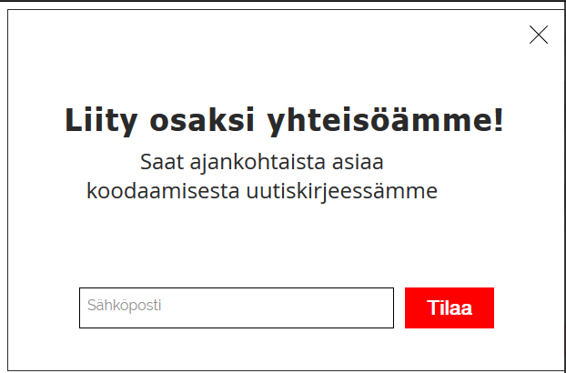
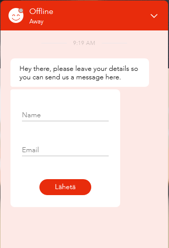
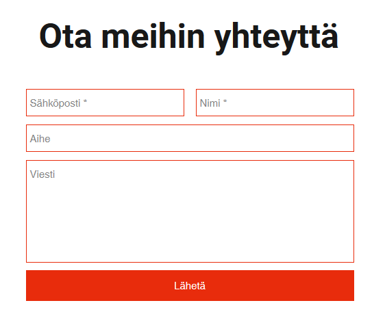
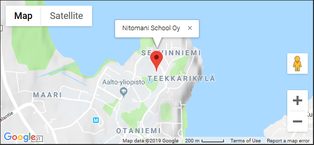
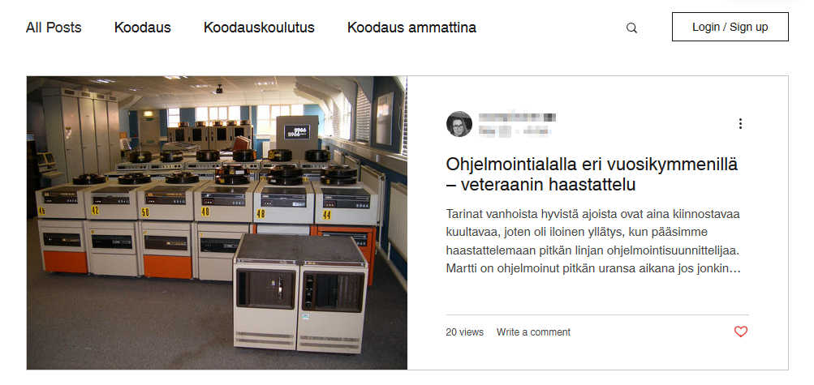
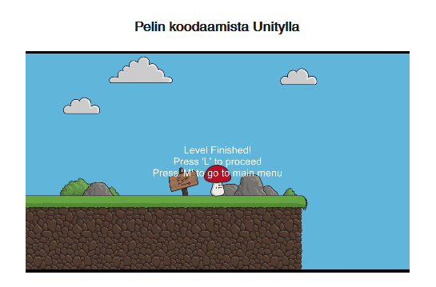
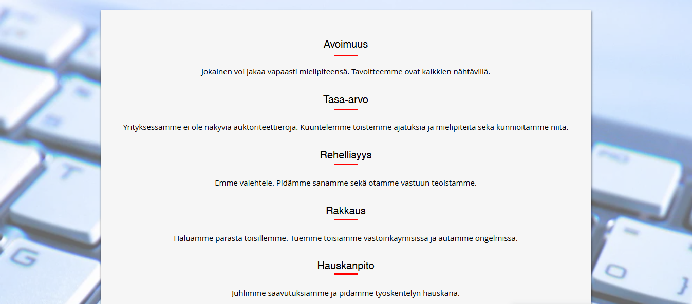

# Nitomani Website Report and Usability Test Plan
- [Nitomani Website Report and Usability Test Plan](#nitomani-website-report-and-usability-test-plan)
  - [Project Report](#project-report)
    - [Motivation and Description](#motivation-and-description)
    - [Project Schedule](#project-schedule)
    - [Features and functionalities](#features-and-functionalities)
    - [Project Evaluation](#project-evaluation)
  - [Usability Test Plan](#usability-test-plan)
    - [Elements of a Test Plan](#elements-of-a-test-plan)
        - [Scope](#scope)
        - [Purpose](#purpose)
        - [Schedule & Location](#schedule-and-location)
        - [Sessions](#sessions)
        - [Equipment](#equipment)
        - [Participants](#participants)
        - [Scenarios](#scenarios)
        - [Metrics](#metrics)
        - [Quantitative metrics](#quantitative-metrics)
        - [Roles](#roles)
    - [Identifying Test Metrics](#identifying-test-metrics)
        - [Successful Task Completion](#successful-task-completion)
        - [Critical Errors](#critical-errors)
        - [Non-Critical Errors](#non-critical-errors)
        - [Error-Free Rate](#error-free-rate)
        - [Time On Task](#time-on-task)
        - [Subjective Measures](#subjective-measures)
        - [Likes, Dislikes and Recommendations](#likes-dislikes-and-recommendations)    
    - [User Instructions of Most Common Tasks](#user-instructions-of-most-common-tasks)

## Project Report

### Motivation and Description
As part of my training I was given the task to improve the existing website of Nitomani School. At that time the website had a few pages and many features missing which I though need to be added in the site. As I was discussing with the school owner, he was suggesting to contribute to the site as a designer as well as for search engine optimization. I was also given the task to improve on the functionality of the features and add my own flavor to the site as a graphic designer from their brand and business theme.

### Project Schedule
We didn't have any planned schedule for the site but sometimes I was given a task and was asked if I could do that task by some given specific amount of time. Otherwise I was free to plan on my own. The schedule went like this:

> - _planning, discussing, brainstorming: 2-3 days_
> - _ui design: 2-3 days_
> - _working around with the platform/setup: 2 days_
> - _development: 2 weeks_
> - _changes based on feedback: 1 week_
> - _search engine optimization: 2 days_
> - _deployment: 2-3 days_

As I had to remake some contents and later made changes due to 3rd party database error; I had to take more time later on.

### Features and functionalities
Other than redesigning some of the pages and sections I have added dynamically upgradable post page like blog/news page which is now manually updated and maintained by someone. Contact page can get information and send it to the receiver. Similarly there is a chat bot which has the messenger like functionality. While in the pages there are buttons to redirect to the desired sections or pages, there are forms for user to input information. The website is built in two different languages; primary urls in finnish and secondary english.

#### Planned features and functionalities to include were:

 **Pages:**
> - _Koti_
> - _Oppilaitoksille_
> - _Opettajille_
> - _Yrityksille_
> - _Meistä_
> -_Yhteystiedot_
> - _Arvomme_
> - _Blogi_

 **Overall features and functionalities:**
> - _Redesigning overall theme, changing font, color, shapes, effects and style etc_
> - _Adding and changing navigation to sections and pages through anchors and buttons_
> - _Adding social links, location map etc_
> - _Making contact form_
> - _Including chat bot_
> - _Adding media files where ever needed_
> - _Adding english translated pages and sections_
> - _Making the site responsive for all devices eg, tablet, mobile etc_
> - _Adding title and meta tags for all the pages_
> - _Indexing site to search engines_
> - _Other minor technical fixes_

#### Added features and functionalities:

 **Pages:**
> (All of the above and some others were added later on)
> - _[Koti](https://www.nitomani.com/)_
> - _[Paketit ja hinnasto](https://www.nitomani.com/paketit-ja-hinnasto)_
> - _[Oppimisympäristö](https://www.nitomani.com/oppimisymparisto)_
> - _[Oppilaitoksille](https://www.nitomani.com/oppilaitoksille)_
> - _[Opettajille](https://www.nitomani.com/opettajille)_
> - _[Yrityksille](https://www.nitomani.com/yrityksille)_
> - _[Meistä](https://www.nitomani.com/meista)_
> - _[Yhteystiedot](https://www.nitomani.com/yhteystiedot)_
> - _[Arvomme](https://www.nitomani.com/arvomme)_
> - _[Blogi](https://www.nitomani.com/blogi)_
> - _[Arkistot](https://www.nitomani.com/arkistot)_

**Overall features and functionalities:**
>   All of the above features and functionalities were implemented.

Examples:

_Fig.1 Monthly newsletter subscription form_

>

_Fig.2 Chat bot_

>

_Fig.3 Contact form_

>

_Fig.4 Map_

>

_Fig.5 Blog post_

>

_Fig.6 Embedded video_

>

_Fig.7 Static feature (font, design, background etc)_

>

### Project Evaluation
The project was overall fun and exciting and made me feel proud to carry out overall decision making and planning for a running company. The website had different features which allowed me to discover and implement contents that I was not being able to experience before. It was also the first time for me to actually indexing a website in search engine like Google.
It was also a good experience to work in a agile set up and get things done in a group set up. Coming up with different solutions of sudden arising problems was also very new and exciting.
I tried to make the website look as modern as possible and the performance as smooth as it could possibly be. Regarding the platform it was hard at times to work online as the server is not setup locally. Sudden database error was a huge pain to deal with at times. And sometimes depending on the internet speed updates done might take time to be applied and you might get certain data lost at times if their is any connection error. As the website contains a lot of pages and media files, it lags a bit in terms of loading. In this case some other platform could have been a better choice. After I was done with the project, some changes made to the website later on doesn't quite suite my taste. But overall I was able to pull off on time as much as possible and I am happy with the outcome.

## Usability Test Plan

### Elements of a Test Plan

- ###### Scope
The usability test was planned to be done on the official site of Nitomani School as this was the project I was working on. The test was done after finishing prototyping, after making or redesigning pages, after publishing pages.

- ###### Purpose
The purpose was to see if the user; in this case the owner of the company can actually see the contents properly and if the design was visually appealing or meets brand theme. If certain sections are easy to access from it's position. If the page is supposed to navigate to certain directions which is user friendly. If the page is lagging while loading causing bad user experience. If it's responsive to the user in different devices etc.

- ###### Schedule & Location
In case of scheduling it was planned to be made after prototyping, before and after publishing. Some of the contents were sent via slack initially after prototyping and the location was the workplace.

- ###### Sessions
the sessions lasted from 15 minutes to half an hour depending on the number of items to be observed and the level of complication of the matter.

- ###### Equipment
The type of equipments were chrome or firefox browsers in laptop, ipad, mobile devices with different screen sizes.

- ###### Participants
It was planned to be done on three people from the company but one of the sessions had only one person present.

- ###### Scenarios
There were typically over 5 scenarios planned to be observed before each session.

- ###### Metrics
Depending on the content I had plans which question to ask beforehand for instance after making prototype I planned to ask if the user was satisfied with the header background picture and it's proportion, if the design of the texts are readable, if the grid with three columns looks clumsy or ok, if the button is on to be placed inside the a particular section etc. 

- ###### Quantitative metrics
the quantitative metrics went mostly successful other than some minor changes. The biggest problem was with responsiveness.

- ###### Roles
In this case I was the only one appointed to do the task as the sole developer.

### Identifying Test Metrics
- ###### Successful Task Completion
I noted down the options that could have been alternatives to the current content that I have redesigned. When user was given the other options; most of the time the one that I have already implemented in redesigning was chosen.

- ###### Critical Errors and Non-Critical Errors
These types of errors were not met during the sessions.

- ###### Error-Free Rate
In this case one person was not able to complete two to three tasks in two sessions.

- ###### Time On Task
Time was not a problem, but the platform was a bit laggy and sometimes didn't get good internet connection to meet the desired result.

- ###### Subjective Measures
Most of the time the outcome was quite satisfactory.

- ###### Likes, Dislikes and Recommendations
Most of the time it was positive. I got most error in case of the platform having some issues with responsiveness. Other than that I got some suggestions to replace some media files or add some new contents and due to that redesign again after initial redesign.

## User Instructions of Most Common Tasks

- ##### Using chat bot
  - After entering the site user can see a chat bot which is a messenger to interact with the person who is in charge with communication with the client.
  - You enter your desired message or information that you need to convey in the person in charge is online.
  - If the person in charge is offline, in that case the user needs to write his/her name and email address in the form and submit to unlock the chat option where the user can now send the message to be checked later.

- ##### Contact
  - If user needs to send a letter or application or for any kind of formal offline information, user can go to the contact page by clicking on the contact menu from navigation bar.
  - This will open contact page with contact form and additional information for other means of contact for instance via e-mail or phone number.
  - In the contact form user needs to enter his/her email address, name, subject of the message and the message in the required fields.
  - Then click send button to submit the message.
  - An confirmation auto generated e-mail would be sent to the user's e-mail address afterwards.

- ##### Sharing news
  - User can navigate to the news section from navigation menu.
  - Can select any post to read by clicking on the title.
  - Can click on :heart: if the user like the post.
  - There are icons underneath the post indicating to share the post in `facebook, twitter, google+` or just `copy the link` of the post.
  - If the user clicks on any social media icon it will open a pop up window to sign in in that social media site and sharer the post. In case already signed in it will directly just ask you to share under your profile.
  - In case of `copy the link` option a pop up dialog box will open with options to copy or cancel.
  - You can also navigate through recent posts to read in the recommendation underneath.
